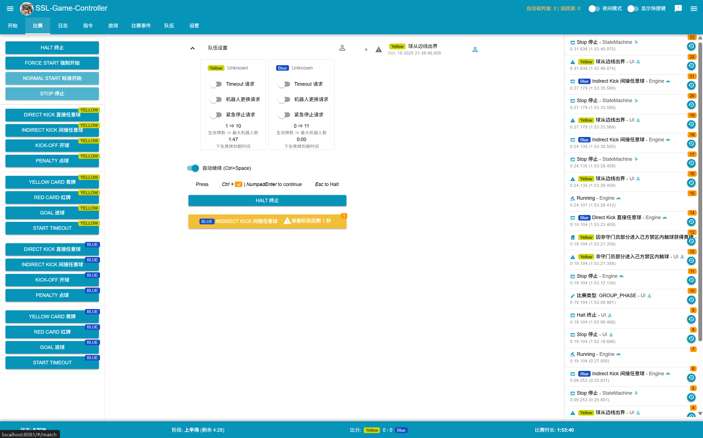

[](https://circleci.com/gh/RoboCup-SSL/ssl-game-controller/tree/master)
[](https://goreportcard.com/report/github.com/Robocup-ssl-China/ssl-game-controller)
[](https://godoc.org/github.com/Robocup-ssl-China/ssl-game-controller)
[](https://github.com/lkhcode/ssl-game-controller/releases/latest)
[](https://circleci.com/api/v1.1/project/github/Robocup-ssl-China/ssl-game-controller/latest/artifacts/0/coverage?branch=master)

# ssl-game-controller

本项目Fork自[Robocup-SSL的ssl-game-controller](https://github.com/RoboCup-SSL/ssl-game-controller)，基于Robocup世界杯的裁判盒，针对[Robocup世界杯中国公开赛](http://crc.drct-caa.org.cn/static/kindeditor/attached/file/20250207/20250207014751_79139.pdf)与[浙江省大学生机器人竞赛足球机器人赛项](https://oss.moocollege.com/27757/edit/HIZ0s6JS_1742376586041.pdf)的比赛规则进行了修改与适配



# 与官方裁判盒的差异

1. 对软件的操作界面进行了汉化
- 对于裁判盒UI的各种按钮，command指令，犯规，违例，进行了汉化
- 对于裁判盒中，发出指令的各种按钮，保留了中英双字，如`INDIRECT KICK 间接任意球`,`KICK OFF 开球`等
- 裁判盒中的翻译大多参照国赛与省赛中的定义，其余部分使用了豆包进行翻译

2. 在国际赛中，间接任意球被删去，只留下了`DIRECT KICK(即FREE KICK 任意球)`，本项目重新启用了proto中被弃用的INDRECT部分，并修改了部分协议，不过协议的修改不会影响队伍的rocos的裁判盒指令接收，重新启用的协议如下：
- 间接任意球 `INDIRECT_FREE_KICK`
- 机器人在对方禁区内触碰对方机器人 `ATTACKER_TOUCHED_OPPONENT_IN_DEFENSE_AREA`
- 机器人在对方禁区内触碰对方机器人 (忽略) `ATTACKER_TOUCHED_OPPONENT_IN_DEFENSE_AREA_SKIPPED`
- 非守门员部分进入己方禁区内触球 `DEFENDER_IN_DEFENSE_AREA_PARTIALLY`

3. 发生以下事件，比赛暂停，下一指令为直接任意球
- 球从球门线出界 `BALL_LEFT_FIELD_GOAL_LINE`
- 球从边线出界 `BALL_LEFT_FIELD_TOUCH_LINE`
- 机器人到对方禁区距离过短 `ATTACKER_TOO_CLOSE_TO_DEFENSE_AREA`
- 机器人推挤 `BOT_PUSHED_BOT`
- 机器人护球 `BOT_HELD_BALL_DELIBERATELY`
- 机器人翻倒 `BOT_TIPPED_OVER`
- 机器人掉落零件 `BOT_DROPPED_PARTS`
- 机器人将球踢出场外 `BOUNDARY_CROSSING`
- 机器人相互碰撞 `BOT_CRASH_DRAWN`
- 机器人碰撞 `BOT_CRASH_UNIQUE`
- 点球失败 `PENALTY_KICK_FAILED`
- 无效进球 `INVALID_GOAL`

4. 发生以下事件，比赛暂停，下一指令为间接任意球
- 无意义射门 `AIMLESS_KICK`
- 守门员清球超时 `KEEPER_HELD_BALL`
- 带球过度 `BOT_DRIBBLED_BALL_TOO_FAR`
- 二次触球 `ATTACKER_DOUBLE_TOUCHED_BALL`
- 机器人在对方禁区内触碰对方机器人 `ATTACKER_TOUCHED_OPPONENT_IN_DEFENSE_AREA`
- 球速过快 `BOT_KICKED_BALL_TOO_FAST`

5. 裁判指令现在可以发出Indirect Free kick，自动裁判部分也增加了使用间接任意球恢复比赛的选项

6. 恢复`部分进入禁区触球 DEFENDER_IN_DEFENSE_AREA_PARTIALLY`的定义，在国际赛中，只保留了进入己方禁区触球，给一次点球
- `部分进入己方禁区触球 DEFENDER_IN_DEFENSE_AREA_PARTIALLY`，停止比赛，给对方直接任意球，给一张黄牌
- `完全进入己方禁区触球 DEFENDER_IN_DEFENSE_AREA`，停止比赛，点球一次
- tips:部分进入己方禁区触球，需要autoref配合检测，我不确定TIGERS的AutoReferee有没有保留这个事件的检测，但是你可以在GC里面手动添加该事件

7. 无意义射门(`AIMLESS_KICK`)在国际赛中，仅适用于B组，本项目关闭了在A组下，无意义射门事件强制转换成出界事件的功能

8. 以下内容是国际赛的部分，但是不影响使用，没有删除
- 挑战旗
- 紧急暂停
- 机器人更换次数限制
- 机器人外壳颜色

9. 在Makeflile里面新增了一条指令，'make build'，方便进行编译，并对Makefile增加了对Windows平台的支持

> 本程序还没有经过大量测试，可能存在bug，如果您发现了裁判盒的bug，请提交ISSUE给我，也可以提交PR参与开发
## 添加您的队伍

如果您是新队伍，或者您没有在列表中找到您的队伍名称，请在 [internal/app/engine/config.go](internal/app/engine/config.go) 中添加您的队伍名称。

## 使用

如果您只是想使用本应用程序，只需从[Release](https://github.com/lkhcode/ssl-game-controller/releases/latest)下载最新的发布版本即可。该二进制文件是独立的，无需其他依赖。


GC在首次启动时会在 [config/](./config/) 目录下生成默认配置。之后，您可以在那里修改所有设置。

例如，如果您想临时添加一个新的队伍名称，可以将其添加到 [config/engine.yaml](./config/engine.yaml) 中。如果您想永久添加您的队伍，请将其添加到 [internal/app/engine/config.go](internal/app/engine/config.go) 中的 `defaultTeams` 并在 GitHub 上创建一个拉取请求。

### 运行环境要求

* 无软件依赖（开发除外，见下文）
* 预构建二进制文件支持(原版)：64位 Linux、Windows
* 现代浏览器（主要在 Chrome 上测试）

### 外部运行依赖

* [ssl-vision](https://github.com/RoboCup-SSL/ssl-vision) - 接收几何数据包以获取正确的场地尺寸
* 如果没有 ssl-vision，请确保在 [config/ssl-game-controller.yaml](config/ssl-game-controller.yaml) 中配置正确的尺寸

需要一个能产生 [TrackerWrapperPacket](https://github.com/RoboCup-SSL/ssl-vision/blob/master/src/shared/proto/messages_robocup_ssl_wrapper_tracked.proto) 的跟踪源实现来获取球和机器人位置.  
   
这对以下功能是必需的：
* 检查放球进度
* 检查每队机器人数量是否正确
* 检查比赛是否可以继续（球和机器人准备就绪）
* 检查比赛僵持状态
* 检查是否可以通过remote-control更换守门员

[TIGERs AutoRef](https://github.com/TIGERs-Mannheim/AutoReferee) 和 [ER-Force AutoRef](https://github.com/robotics-erlangen/autoref) 是跟踪源的实现示例。如果没有可用的跟踪源，上述功能将无法工作。在国内的比赛中，我们主要使用TIGERs的AutoRef

### 参考样例
官方项目提供了以下参考客户端，便于各队伍开发自己的软件：
 * [ssl-ref-client](./cmd/ssl-ref-client): 接收裁判消息的客户端
 * [ssl-auto-ref-client](./cmd/ssl-auto-ref-client/README.md): 作为自动裁判连接到GC的客户端
 * [ssl-team-client](./cmd/ssl-team-client/README.md): 作为队伍连接到GC的客户端
 * [ssl-remote-control-client](./cmd/ssl-remote-control-client/README.md): 作为远程控制连接到GC的客户端
 * [ssl-ci-test-client](./cmd/ssl-ci-test-client/README.md): 连接到GC的 CI 接口的客户端

### 在命令行运行ssl-game-controller可使用的参数

- `-address string`               提供UI 和 API 服务的地址（默认为 "localhost:8081"）
  
- `-backendOnly`                  仅运行后端，不启动 UI 和 API 服务
  
- `-ciAddress string`             提供 CI 连接服务的地址
  
- `-publishAddress string`        发送裁判命令的地址（IP+端口）
  
- `-skipInterfaces string`        接收多播数据包时要忽略的网络接口名称列表（用逗号分隔）
  
- `-timeAcquisitionMode string`   使用的时间获取模式（system：系统时间，ci：CI模式，vision：视觉系统时间）
  
- `-trackerAddress string`        接收追踪源数据包的地址（IP+端口）
  
- `-verbose`                      输出详细日志信息
  
- `-visionAddress string`         接收视觉系统数据包的地址（IP+端口）

### 集成到您自己的框架
如果您不想为测试目的实现自己的控制器，游戏控制器设计为可以集成到您自己的 AI 框架中。

从 Github 发布页面下载发布版本的二进制文件，并在您的框架内运行它。您可以调整首次启动时生成的 `ssl-game-controller.yaml` 配置文件，比如更改默认端口。某些参数也可以通过命令行传递。使用 `-h` 选项可以查看可用参数。请尽可能使用非标准端口，以避免与实际场地设置产生干扰。

游戏控制器可以在以下三种模式下运行：

1. `system`（默认）：使用系统时间
2. `vision`：接收来自 ssl-vision 的消息，并使用这些消息中的时间戳作为时间源。这在从仿真中生成自己的 ssl-vision 帧时特别有用。
3. `ci`：通过 TCP 直接将您的软件连接到控制器。您发送当前时间戳和跟踪数据包，并将收到相应的裁判消息。

当您将控制器与自己的仿真器集成时，强烈建议使用 `ci` 模式。它具有以下优势：

1. 不需要可能发布到本地网络的多播网络流量（确保取消设置 `network.publish-address`）
2. 您可以完全控制数据流。控制器不会在后台异步执行任何操作
3. 您可以定义时间，从而控制速度
4. 您可以直接提供 ssl-vision 跟踪数据

如果您使用外部仿真器（如 grSim，rocos），可以考虑使用 `vision` 模式。这样，游戏控制器将使用仿真器的时间和速度，即使它不是实时运行的。如果需要上述功能，仍然需要运行一个跟踪源实现，如Autoref。

启用 `ci` 模式时，裁判消息仍将通过多播发布，除非地址未设置（设置为空字符串）。这样，您仍然可以集成自动裁判或其他软件。有关如何以 CI 方式集成自动裁判的详细信息，请参阅 [Auto-referee CI](doc/AutoRefCi.md)。

启用 `ci` 模式时（通过 `ssl-game-controller.yaml` -> `time-acquisition-mode`），将打开一个 TCP 端口（默认：10009）。协议在 [proto/ssl_gc_ci.proto](./proto/ssl_gc_ci.proto) 中定义。您发送 `CiInput` 消息并接收 `CiOutput` 消息。协议与 [team-client](./cmd/ssl-team-client/README.md) 相同。每个输入将产生一个或多个输出。这是因为某些更改会生成多个消息。`CiOutput` 消息也会在 UI 或 UI API 中手动更改时推送到 CI 客户端。

GC 需要一些输入数据，请参阅 [外部运行依赖](#外部运行依赖)。在 `ci` 模式下，您必须在 [config/ssl-game-controller.yaml](config/ssl-game-controller.yaml) 中静态提供几何数据，或通过 `CiInput` 发送。球和机器人位置必须通过 `CiInput` 发送。只需填写必填字段，保持可选字段为空即可。

这里有一个 `ci` 模式的小型测试客户端示例：[ssl-ci-test-client](./cmd/ssl-ci-test-client/README.md)

如果不能使用 `ci` 模式，您可以通过 UI WebSocket API 连接到 GC。API 在 [proto/ssl_gc_api.proto](./proto/ssl_gc_api.proto) 中定义，并在与 UI 相同的端口下的路径 `/api/control` 提供。

#### 示例
 * 二进制集成示例：https://github.com/TIGERs-Mannheim/AutoReferee/blob/master/modules/moduli-referee/src/main/java/edu/tigers/sumatra/referee/SslGameControllerProcess.java
 * Java 中的 WebSocket API 示例：https://github.com/TIGERs-Mannheim/AutoReferee/blob/master/modules/moduli-referee/src/main/java/edu/tigers/sumatra/referee/control

## 开发

### 环境要求

首先需要安装以下依赖：

* Go 语言环境      (Ubuntu建议使用gvm安装)
* Node.js 环境    (Ubuntu建议使用nvm安装)

具体兼容版本请参考 [.circleci/config.yml](.circleci/config.yml)。

### 前端开发

详见 [frontend/README.md](frontend/README.md)

### 构建

构建并安装所有二进制文件：

```bash
make install
```

### 运行

```bash
go run cmd/ssl-game-controller/main.go
```

## 生成二进制文件(Windows/Linux)

```bash
make build
```

### 更新协议缓冲区生成的代码

如果您修改了任何 `.proto` 文件，需要重新生成代码(需要安装buf)：

```bash
make proto
```
